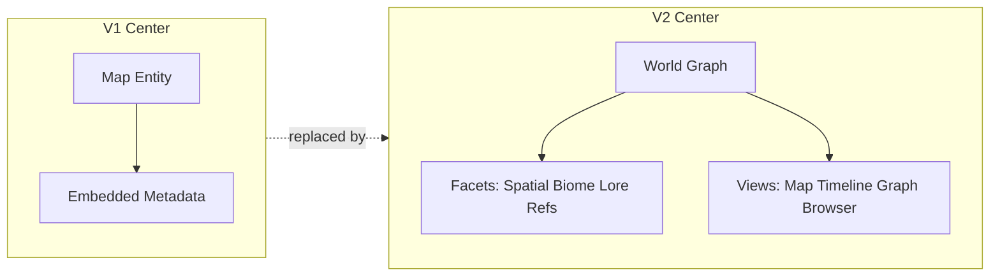
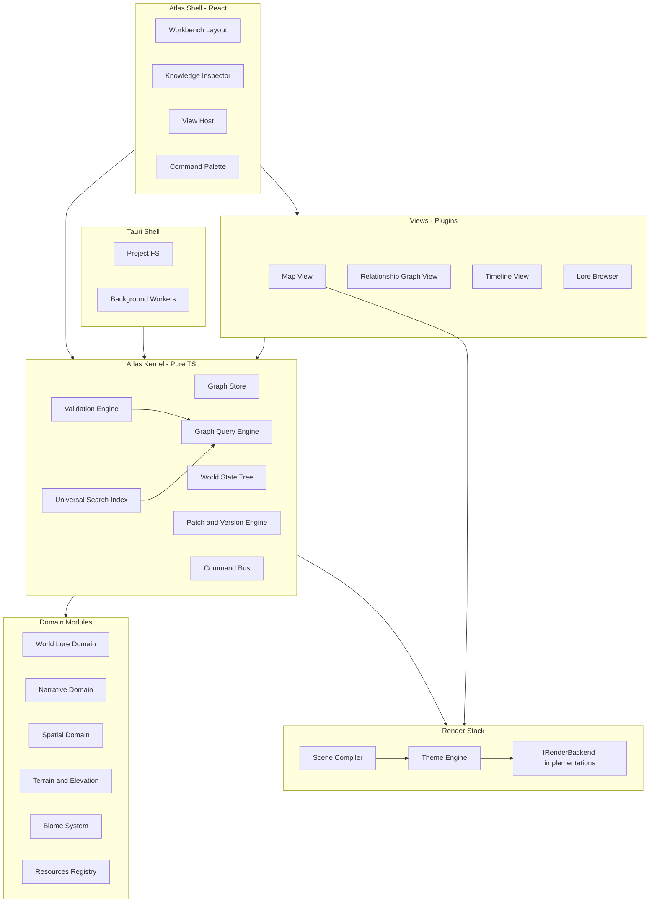
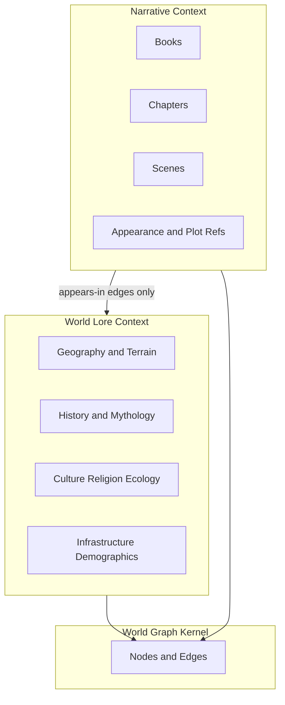
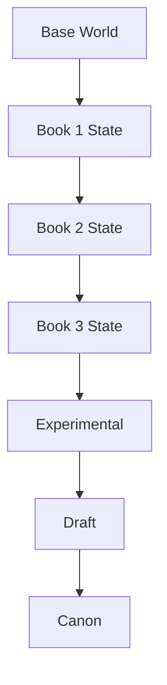
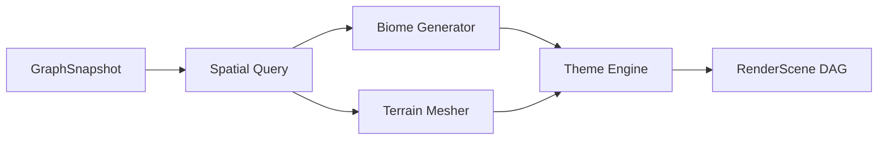
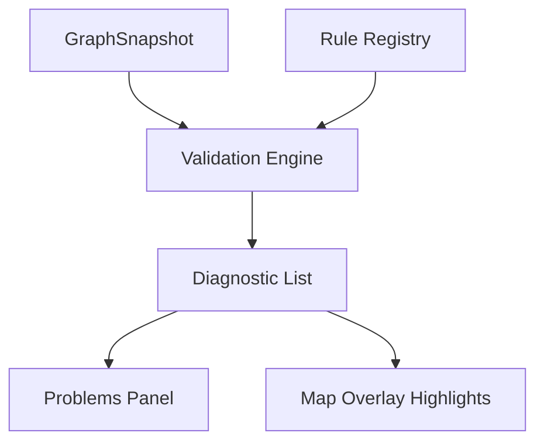

# Atlas Engine — Architecture Version 2

**Product codename:** Atlas Engine  
**Domain:** Fantasy World Development Environment (FWDE) for *The Shakti Isles* / *Mihiraan's Secret*  
**Supersedes:** Architecture V1 (map-centric world document model)

---

## 1. Executive Summary

Version 1 was a strong **map editor with world metadata attached**. Version 2 redesigns the product as **Atlas Engine** — software in the same category as VS Code (code), Figma (design), and Blender (3D), but for **interconnected fictional worlds**.

The canonical source of truth is the **World Graph**: a typed, versioned, searchable network of nodes (locations, characters, artifacts, biomes, books, scenes, cultures, pearls, tatvanu, etc.) and relationships (`lives-at`, `capital-of`, `bonded-to`, `appears-in`). The map is **one view** over the spatial subset of that graph — not the center of the universe.

V2 introduces six structural upgrades over V1:

1. **Graph-native data model** — everything is a node or edge; map geometry is a *facet*, not the object itself
2. **Lore/Narrative separation** — world truth and book story live in distinct bounded contexts that reference each other by ID, never by embedding
3. **World States with inheritance** — Base World → Book 1 → Book 2 → … → Canon; only diffs are stored
4. **Procedural domain systems** — biomes, vegetation, elevation, and water are parametric regions, not thousands of placed objects
5. **Pluggable rendering + themes** — renderer backends are swappable; artistic style is a theme applied to the same graph
6. **Validation Engine** — semantic consistency checking is a first-class module, not an afterthought

Stack remains: **Tauri 2 + React + TypeScript**, local-only, JSON on disk, no backend. Complexity is shifted from ad-hoc entity registries to **well-bounded modules** with clear extension surfaces.

---

## 2. Critique of Version 1

A principal-engineer review of V1, honestly scored against a 5–10 year horizon:

### 2.1 Fatal Structural Issues (must fix in V2)

| Issue | Why it breaks at scale |
|-------|------------------------|
| **Map-first entity model** | `Entity` is defined by geometry + layer + style. Characters, books, and cultures are secondary registries. Adding pearls, tatvanu, magic systems requires bolting on more registries — the model fights the FWDE vision. |
| **Lore and narrative conflated** | `EntityMetadata` embeds `lore`, `narrative.appearances`, and `history` on the same object. Editing Book 3 chapter refs risks touching geographic truth; exporting "world bible" vs "book bible" requires untangling merged data. |
| **Three overlapping temporal systems** | Timeline eras + entity temporal snapshots + book overlays = three ways to express "world at Book 2." Authors will corrupt state; migrations will be ambiguous. |
| **PixiJS hardwired in `renderer` package** | V1 names the package `renderer` but specifies PixiJS throughout. No path to WebGPU, 3D elevation views, or headless SVG without rewrite. |
| **No validation beyond schema** | Zod validates JSON shape, not "village has no freshwater" or "character appears before introduction." Story consistency modules have nowhere to hook in. |

### 2.2 Scalability Bottlenecks

| Bottleneck | Manifestation |
|------------|---------------|
| **Monolithic `WorldDocument`** | Commands mutate an entire document tree. At 10k+ nodes with rich lore, Immer copy costs and React re-render fan-out hurt even with sharding. |
| **Flat `entities` registry** | Characters and settlements share a bucket differentiated by `type`. Graph traversals ("all nodes within 2 hops of Roma") require ad-hoc edge lists, not indexed queries. |
| **Per-object vegetation** | V1 has no biome concept. Forests as polygons or placed decorations → unbounded object count, unusable exports, editor lag. |
| **MiniSearch on entity metadata** | Cannot search relationships ("who is bonded to Sky Pearl?"), graph patterns, or cross-context narrative refs uniformly. |
| **Display geometry per entity** | Artistic overrides stored per entity × per book overlay → combinatorial storage explosion across World States. |

### 2.3 Unnecessary or Premature Complexity (V1)

| Item | Verdict |
|------|---------|
| XState for every tool | Keep for complex tools (path edit, biome paint); overkill for pan/zoom/select |
| Book overlay display overrides | Replace with World State diffs — one mechanism, not two |
| Separate `characters` and `chapters` registries outside graph | Redundant if graph nodes ARE characters and chapters |
| `temporal.snapshots` on entities | Duplicates World State diff storage |

### 2.4 What V1 Got Right (preserve in V2)

- Tauri 2 for local-first desktop
- Pure TypeScript core, React as shell only
- Command pattern + undo for edit operations
- JSON as portable canonical format (evolve shape, keep principle)
- Hybrid geo/display coordinates (refined as Spatial Facet + Presentation Layer)
- SVG reconstructed from source data, never viewport screenshots
- Plugin readiness and schema migrations with unknown-field preservation
- Monorepo with strict dependency boundaries

---

## 3. Architectural Improvements (V1 → V2 Summary)



| Dimension | V1 | V2 |
|-----------|----|----|
| Canonical truth | WorldDocument / entities | World Graph (nodes + edges) |
| Map role | Primary object container | Spatial View over graph |
| Lore vs narrative | Mixed in EntityMetadata | Separate bounded contexts, linked by ref |
| Time / books | Timeline + snapshots + overlays | World States (inheritance + diffs) |
| Forests / terrain | Polygons or decorations | BiomeRegion nodes + procedural gen |
| Elevation | Not modeled | TerrainFacet + heightfield |
| Renderer | PixiJS package | IRenderBackend implementations |
| Style | Per-entity styleId | Theme system applied at compile time |
| Assets | assets/ folder | Resources registry (fonts, themes, brushes, …) |
| Inspector | Property tabs | Knowledge Inspector (graph-aware) |
| Consistency | Schema only | Validation Engine + rule plugins |
| Search | MiniSearch on entities | Universal Graph Search index |
| Mutations | Whole-document commands | Graph patches scoped by domain |

---

## 4. Revised High-Level Architecture



### Layer rules (dependency direction)

1. **Atlas Kernel** knows nodes, edges, patches, states, queries — not map coordinates or book prose
2. **Domain modules** extend the kernel with facet schemas and domain commands — never import React
3. **Views** are plugins that read kernel + domains and host UI — Map View is view #1, not the app
4. **Render stack** consumes a **compiled scene description** — never reads raw JSON directly
5. **Validation Engine** reads all domains but mutates nothing

---

## 5. Core Modules

### 5.1 Monorepo Structure (revised)

```
atlas-engine/
├── apps/
│   └── desktop/                    # Tauri + React workbench
├── packages/
│   ├── kernel/                     # Graph, patches, states, queries, commands
│   ├── schema/                     # Zod types, migrations, facet registrations
│   ├── world-lore/                 # Diegetic world content domain
│   ├── narrative/                  # Books, chapters, scenes domain
│   ├── spatial/                    # Coordinates, geometry, spatial index
│   ├── terrain/                    # Elevation, slope, hydrology facets
│   ├── biomes/                     # Biome definitions + procedural params
│   ├── resources/                  # Fonts, themes, symbols, palettes
│   ├── validation/                 # Rule registry + consistency engine
│   ├── search/                     # Index builder + query API
│   ├── render-core/                # Scene compiler, IRenderBackend, ThemeEngine
│   ├── render-pixi/                # PixiJS backend (default viewport)
│   ├── render-svg/                 # SVG export backend
│   ├── editor/                     # Tools, selection, undo glue
│   ├── plugins-sdk/                # Extension API
│   └── ui/                         # Shared React components
├── views/
│   ├── map/                        # Map View plugin
│   ├── graph/                      # Relationship graph visualization
│   └── timeline/                   # Historical / narrative timeline
├── themes/
│   └── shakti/                     # First-party theme packs
├── resources/
│   └── shakti-isles/               # Default symbol sets, fonts
└── docs/architecture/
```

### 5.2 Module Responsibilities

| Module | Owns | Must NOT own |
|--------|------|--------------|
| `kernel` | Node/edge CRUD, World State tree, patch apply/merge, event bus | Rendering, UI, domain semantics |
| `world-lore` | Lore facets, culture, religion, ecology, mythology content | Chapter scenes, dialogue |
| `narrative` | Book, Chapter, Scene nodes; appearance refs; plot events | Geographic coordinates |
| `spatial` | Geo/display frames, geometry facets, spatial index | Biome procedural gen |
| `terrain` | Heightfields, slope, flow, cliff/waterfall params | Narrative validation |
| `biomes` | BiomeRegion facets, generator params, seed | Individual tree placement |
| `resources` | Resource registry, theme packs, symbol defs | Graph nodes |
| `validation` | Rules, diagnostics, fix suggestions | Direct graph mutation |
| `search` | Inverted index + graph traversal queries | UI presentation |
| `render-core` | Scene DAG, theme application, backend dispatch | World Graph storage |
| `editor` | Tool routing, hit testing glue, command dispatch | Facet schema definitions |

### 5.3 Atlas Kernel — The Heart

The kernel provides four primitives:

**Node** — identity + kind + universal metadata  
**Edge** — typed directed (or undirected) relationship  
**Facet** — a named, schema-versioned attachment on a node (a node has many facets)  
**Patch** — an immutable state mutation record applied within a World State context  

```typescript
// Conceptual shapes only
Node {
  id: NodeId
  kind: NodeKind               // "location" | "character" | "biome-region" | "book" | ...
  name: string
  tags: string[]
  facets: Record<FacetKey, FacetPayload>   // keyed by facet type
  system: { createdAt, modifiedAt, createdInState: StateId }
}

Edge {
  id: EdgeId
  kind: EdgeKind               // "lives-at" | "located-on" | "capital-of" | "bonded-to" | ...
  source: NodeId
  target: NodeId
  attrs?: Record<string, unknown>
  validInStates?: StateId[]    // optional edge lifecycle
}

WorldState {
  id: StateId
  name: string                 // "Book 2", "Canon", "Experimental Draft"
  parentId?: StateId           // inheritance chain
  patches: Patch[]             // only diffs from parent
}
```

**Materialized graph:** `resolve(stateId)` walks inheritance chain, applies patches oldest→newest, produces read-only `GraphSnapshot` for queries and rendering. Cached with LRU; invalidated on patch append.

---

## 6. World Graph Design

### 6.1 Node Taxonomy (extensible via plugins)

**Geographic / spatial kinds:**  
`Location`, `Region`, `Settlement`, `Landmark`, `Route`, `BiomeRegion`, `WaterBody`, `Island`

**Inhabitants / agents:**  
`Character`, `Organization`, `Species`, `Culture`

**Objects / systems:**  
`Artifact`, `Pearl`, `Tatvanu`, `MagicSystem`, `Language`, `Religion`

**Historical (world lore):**  
`HistoricalEvent`, `Era`, `Dynasty`, `War`, `Treaty`

**Narrative (book domain):**  
`Book`, `Chapter`, `Scene`, `PassageRef`

**Meta:**  
`Note`, `Secret`, `Document`, `MediaAsset`

Custom kinds (e.g. `Tatvanu`) register via plugin with facet requirements — no kernel changes.

### 6.2 Edge Taxonomy

Edges are **first-class persisted data**, indexed for traversal:

| Edge kind | Example |
|-----------|---------|
| `located-on` | Gurukul → Vasundhara Dwipa |
| `lives-at` | Roma → Gurukul |
| `bonded-to` | Sky Pearl → Roma |
| `capital-of` | Rajgriha → Shakti Isles |
| `ruled-by` | Island in Ruins → Mihiraan (historical) |
| `part-of` | Gurukul → Rajgriha Prefecture |
| `connects` | Trade Road → Settlement A, Settlement B |
| `appears-in` | Roma → Scene (narrative cross-ref) |
| `mentioned-in` | Artifact → Chapter |
| `precedes` | HistoricalEvent → HistoricalEvent |
| `contradicts` | Note → Scene (author flag) |
| `derived-from` | BiomeRegion → Region (spatial containment) |

### 6.3 Facets — Separating Concerns on One Node

A `Settlement` node might carry:

| Facet | Domain | Contents |
|-------|--------|----------|
| `spatial` | spatial | geo polygon, display anchor, hybrid mode |
| `terrain` | terrain | elevation stats, slope class, terrace flag |
| `biome` | biomes | none (biome is separate BiomeRegion node) |
| `lore` | world-lore | description, mythology, culture notes |
| `demographics` | world-lore | population, groups (author-authored, not simulated) |
| `infrastructure` | world-lore | water source, farmland area, governance |
| `narrative-refs` | narrative | **only IDs** of scenes/chapters where settlement appears |
| `secrets` | world-lore | hidden author notes, unrevealed lore |
| `media` | resources | linked documents, reference images |

**Critical rule:** Narrative prose and scene content live on `Chapter`/`Scene` nodes in the **narrative domain**. Geographic nodes hold **references only** — never embedded chapter text.

### 6.4 World Lore vs Book Narrative — Bounded Contexts



**Persistence separation:**

```
TheShaktiIsles.atlas/
├── manifest.json
├── graph/
│   ├── nodes/                  # sharded: {kind}/{id-prefix}.json
│   └── edges.jsonl             # append-friendly edge log (compact merged on save)
├── states/
│   ├── base.json               # root World State (patches empty)
│   ├── book-01.json            # patch chain metadata
│   └── canon.json
├── lore/                       # large rich-text blobs keyed by nodeId+facet
│   └── {nodeId}/
│       ├── description.json
│       └── mythology.json
├── narrative/
│   ├── books/
│   │   └── book-01/
│   │       ├── meta.json
│   │       └── chapters/
│   └── scenes/
├── terrain/
│   └── heightfields/           # binary or compressed JSON grids per region
├── resources/
│   ├── themes/
│   ├── symbols/
│   └── fonts/
└── .atlas/                     # editor workspace, caches, backups
```

Lore rich-text (TipTap JSON) stored **outside** node shards to keep graph loads fast. Kernel stores a content hash + path reference in the facet.

### 6.5 World States — Inheritance Model



**Patch types:**

- `node-upsert` — create or replace facet payload in this state
- `node-remove` — node ceases to exist in this state branch
- `edge-upsert` / `edge-remove`
- `node-rename`, `tag-add`, `tag-remove`

**Resolution algorithm:**

```
resolve(state):
  if cached: return cache
  chain = walkParents(state)   // [Base, Book1, Book2, target]
  graph = empty
  for s in chain:
    applyPatches(graph, s.patches)
  cache(state, graph)
  return graph
```

**Author workflow:** Editing while "Book 2" is active appends patches to `book-02` state. Base geography unchanged. Canon state is a promoted branch, not a copy.

**Diff inspection:** Built-in "compare states" view shows patch list and visual diff on map — essential for continuity editing.

### 6.6 Versioning (beyond undo)

| Mechanism | Scope | Purpose |
|-----------|-------|---------|
| Session undo | Command stack | Editing ergonomics |
| World State patches | Persistent | Book-era world evolution |
| Node revision log | Optional per-node append-only | "When did Rajgriha become capital?" |
| Project snapshots | Manual named saves | Milestone backups before risky refactors |

Undo ≠ World State. Authors must understand: undo is session-local; state patches are deliberate world evolution.

---

## 7. Rendering Architecture

### 7.1 Core Principle

**Render(data), don't store(pixels).**  
The render pipeline is a pure function of:

```
(GraphSnapshot, ActiveWorldState, ActiveTheme, ViewConfig, Camera) → RenderScene → Backend → Output
```

### 7.2 IRenderBackend Interface

```typescript
interface IRenderBackend {
  id: string
  capabilities: {
    interactive: boolean
    export: boolean
    gpu: boolean
    vector: boolean
  }

  initialize(config: BackendConfig): Promise<void>
  compile(scene: RenderScene): CompiledScene
  render(compiled: CompiledScene, camera: Camera): void
  export(compiled: CompiledScene, options: ExportOptions): Promise<ExportResult>
  dispose(): void
}
```

**First-party backends:**

| Backend | Package | Use |
|---------|---------|-----|
| PixiBackend | `render-pixi` | Default interactive map viewport |
| SVGBackend | `render-svg` | Infinite-quality vector export |
| CanvasBackend | `render-canvas` | Fallback / headless thumbnails |
| *(future)* WebGPUBackend | `render-webgpu` | Large procedural scenes |
| *(future)* ThreeBackend | `render-three` | 3D elevation flythrough |

Map View depends on `IRenderBackend`, not PixiJS directly. PixiJS is the default implementation, swappable per view or export job.

### 7.3 Scene Compiler Pipeline



**RenderScene** is backend-agnostic:

```typescript
RenderScene {
  layers: RenderLayer[]          // ordered
  nodes: RenderNode[]            // paths, text, symbols, procedural patches
  defs: ResourceDefs             // patterns, gradients, symbol refs
  metadata: { stateId, themeId, bounds }
}

RenderNode {
  id: NodeId
  kind: "path" | "text" | "symbol" | "procedural" | "group"
  transform: Matrix
  style: ResolvedStyle           // from theme
  payload: ...                  // backend interprets
  pickable: boolean
  lod: number
}
```

### 7.4 Theme System

Themes are **Resources** — interchangeable without touching graph data.

```typescript
Theme {
  id: ThemeId
  name: string                   // "Fantasy Atlas", "Royal Archive", ...
  palette: ColorPalette
  typography: FontRoles
  lineStyles: Record<string, LineStyle>
  symbolMap: Record<NodeKind, SymbolId>
  regionStyles: Record<string, FillStyle>
  biomeGenerators: Record<BiomeKind, GeneratorStyleParams>
  terrainStyle: TerrainStyleParams
  labelRules: LabelPlacementRules
}
```

**Shipped themes (examples):** Fantasy Atlas, Royal Archive, Ancient Scroll, Political Map, Terrain Map, Explorer Map, Blueprint.

Same graph + state → switch theme → full visual recompile. Export profile selects theme independently of editor theme.

### 7.5 Biome System — Procedural Regions

**Do not store trees.** Store **BiomeRegion** nodes with parametric facets:

```typescript
BiomeFacet {
  biomeKind: "ancient-forest" | "mangrove" | "rice-terraces" | "coral-reef" | ...
  params: {
    density: number
    variationSeed: number
    speciesMix?: Record<string, number>
    edgeSoftness: number
    custom?: Record<string, unknown>   // plugin-extensible
  }
  spatialBinding: RegionRef            // covers polygon from spatial facet
}
```

**Biome Generator** (in `biomes` module):

- Input: BiomeRegion facet + terrain facet + theme biome style + camera LOD
- Output: `RenderNode` of kind `procedural` with generator recipe, not 10k tree nodes
- LOD: zoomed out → simplified texture fill; zoomed in → procedural scatter with deterministic seed (same seed = same export)

Applies equally to: orchards, grasslands, rocky coast, reefs, farm terraces.

### 7.6 Elevation Model

**TerrainFacet** on region/island nodes:

```typescript
TerrainFacet {
  heightfieldRef?: HeightfieldId   // compressed grid in terrain/
  stats: { min, max, meanElevation }
  slope: "flat" | "rolling" | "steep" | "cliff"
  terracing: boolean
  hydrology: {
    flowDirection?: VectorFieldRef  // derived or authored
    riverNodes?: NodeId[]           // Route nodes fed by terrain
    waterfallMarkers?: Point[]
  }
}
```

**Heightfield storage:** 16-bit quantized grids, chunked by region. Not in graph node JSON — referenced by ID.

**Rendering influence:**

- Hillshade in Terrain Map theme
- Cliff edge detection → automatic cliff styling
- Water flows downhill (visual arrow hints in validation overlay)
- Future ThreeBackend uses same heightfield for 3D mesh

**Authoring tools:** Terrain paint brush (height), terrace tool, water flow hint tool — all emit patches to terrain facets.

### 7.7 Map View Position in Architecture

Map View is a **view plugin** that:

1. Subscribes to `GraphSnapshot` + active state + theme
2. Hosts viewport canvas bound to selected `IRenderBackend`
3. Routes pointer events to spatial tools
4. Writes patches via CommandBus — never owns data

Other views (timeline, relationship graph, lore browser) share the same kernel subscription pattern.

---

## 8. Data Model (consolidated)

### 8.1 Identity and References

- All IDs are **UUIDv7** (time-sortable) — better for edge logs and debugging
- References are always `{ ref: NodeId, kind?: NodeKind }` — validated by Validation Engine
- No dangling refs allowed in Canon state (warning in Draft)

### 8.2 Spatial Model (refined hybrid)

Retained from V1, relocated to **Spatial Facet**:

- **Geo frame** — shakti-leagues, fictional projection, measurable distances
- **Display frame** — artistic canvas, per-theme label placement overrides stored in Presentation Patches (World State scoped, not per entity file)
- **Hybrid mode** — `linked` | `free` per node

Presentation overrides are patches in World State ("Book 2 moved label for Rajgriha"), keeping Base World clean.

### 8.3 Narrative Model

```
Book Node
  └─ has-chapter → Chapter Node
       └─ has-scene → Scene Node
            └─ appears-in → Character, Location, Artifact (world nodes)
            └─ references → PassageRef (external manuscript anchor)
```

Scene nodes store: synopsis, POV character ref, chronological marker, **not** full manuscript text (link to external files in `narrative/manuscripts/` if needed).

### 8.4 Resources Registry

Unified replacement for V1 assets:

```typescript
Resource {
  id: ResourceId
  kind: "font" | "symbol" | "texture" | "pattern" | "brush" | "theme" | "palette" | "decor-set"
  name: string
  path: string                   // relative to resources/
  meta: Record<string, unknown>
}
```

Everything reusable, versionable, theme-composable. Symbols referenced by themes, not hardcoded per node.

### 8.5 Patch Storage Format

Patches stored as JSONL for append performance, compacted on save:

```json
{"op":"node-upsert","target":"uuid","state":"book-02","facet":"spatial","payload":{...},"ts":"..."}
```

Enables future CRDT or collaborative editing without format rewrite (not planned now, but format won't block it).

---

## 9. Plugin Strategy

### 9.1 Extension Points (V2)

| Extension | API |
|-----------|-----|
| Node kinds | `registerNodeKind({ kind, requiredFacets, icon })` |
| Edge kinds | `registerEdgeKind({ kind, sourceKinds, targetKinds })` |
| Facet schemas | `registerFacet({ key, schema, domain })` |
| Views | `registerView({ id, component, defaultDock })` |
| Render backends | `registerRenderBackend(BackendFactory)` |
| Themes | theme pack manifest in resources |
| Biome generators | `registerBiomeGenerator({ kind, generate })` |
| Validation rules | `registerRule({ id, severity, check })` |
| Search extractors | `registerSearchExtractor({ nodeKind, extract })` |
| Tools | `registerTool({ id, viewId, stateMachine })` |
| Export profiles | `registerExportProfile({ id, backend, theme })` |
| Consistency analyzers | `registerAnalyzer({ id, query })` — future travel time, population |

### 9.2 Plugin Tiers

**Tier 0 — Core (shipped):** kernel, world-lore, narrative, spatial, map view, pixi + svg backends  
**Tier 1 — First-party plugins:** shakti theme pack, biome generators, book companion view, validation rule pack  
**Tier 2 — Author plugins:** custom node kinds (Tatvanu variants), custom themes  
**Tier 3 — Community (future):** sandboxed Worker plugins with capability manifest  

### 9.3 Plugin Isolation

Phase 1: trusted local plugins only (same as V1).  
Phase 2: Worker sandbox with explicit capability tokens (`read-graph`, `register-rule`, no `write-files`).  

Plugins **never** patch kernel internals — only register into registries.

---

## 10. Validation Engine

### 10.1 Architecture



```typescript
ValidationRule {
  id: string
  severity: "error" | "warning" | "info"
  category: "spatial" | "narrative" | "structural" | "hydrology" | "demographic"
  check(ctx: ValidationContext): Diagnostic[]
}

ValidationContext {
  graph: GraphSnapshot
  stateId: StateId
  spatial: SpatialIndex
  narrative: NarrativeIndex
  query: GraphQueryEngine
}
```

### 10.2 Built-in Rule Categories

**Structural:** duplicate IDs, broken refs, orphaned nodes, invalid edge kinds  
**Spatial:** road crosses impassable terrain, settlement outside region, route discontinuity  
**Hydrology:** village has no freshwater facet, waterfall without height delta  
**Demographic:** population exceeds farmland capacity (author-authored numbers)  
**Narrative:** character appears in scene before `introduced-in` edge, artifact referenced before discovery event  
**Temporal:** historical event ordering conflicts, edge validInStates contradictions  
**Cross-state:** Book 2 patch contradicts Base World immutable fact (configurable immutability flags)

### 10.3 Story Consistency Module (future-ready)

Not simulated in core — **analyzers** plug into Validation Engine:

| Analyzer | Data required | Example question |
|----------|---------------|------------------|
| Travel feasibility | route edges, geo distances, character mobility facet | "Can Roma reach Gurukul in one night?" |
| Resource sufficiency | demographics + infrastructure facets | "Can this civilization feed its population?" |
| Geographic continuity | cross-state spatial diff | "Does Book 3 contradict Book 1 geography?" |
| Introduction order | narrative edges | "Is Pearl mentioned before bonding scene?" |

Analyzers return `Diagnostic` with severity + suggested fix links (jump to node in Knowledge Inspector).

**AI-assisted validation (future):** optional local LLM plugin registers as analyzer — never required, never in core.

### 10.4 Validation UX

- **Problems panel** — VS Code-style, filterable by category/severity
- **Map overlay** — diagnostic highlights on spatial nodes
- **Pre-export gate** — block Canon export on errors (configurable)
- **On-save lint** — debounced validation pass, incremental rule execution on dirty subgraph

---

## 11. Knowledge Inspector

Replaces V1 Property Inspector as the **primary object understanding surface**.

Selecting any node opens a **context-aware, graph-aware** panel:

| Section | Source |
|---------|--------|
| Overview | name, kind, tags, state visibility |
| Geography | spatial facet, terrain, biome coverage, coordinates |
| Lore | world-lore facets (rich text) |
| Demographics | population, groups, infrastructure |
| Relationships | incoming/outgoing edges, 1-hop graph mini-view |
| History | historical events linked via edges |
| Narrative | scenes/chapters appearing in (refs only, click to open) |
| Characters | character nodes linked |
| References | books, manuscripts, media |
| Secrets | author-only facets (hidden in reader export) |
| Metadata | IDs, revision info, plugin facets |
| Validation | diagnostics for this node |

**Design:** Inspector sections are **registered by domain plugins** — adding `MagicSystem` nodes auto-adds a Magic section via facet registration. Inspector is not a hardcoded form.

---

## 12. Universal Search

### 12.1 Search Architecture

```typescript
SearchIndex {
  textIndex: InvertedIndex       // names, lore plain text, tags
  kindIndex: Map<NodeKind, NodeId[]>
  edgeIndex: Map<EdgeKind, Edge[]>
  facetIndex: Map<FacetKey, NodeId[]>
}

search(query: SearchQuery): SearchResult[]
```

**SearchQuery supports:**

- Full text: `"Sky Pearl"`
- Kind filter: `kind:character`
- Edge traversal: `bonded-to:Roma`
- Facet filter: `biome:ancient-forest`
- State-aware: results reflect materialized active state
- Narrative scope: `appears-in:book-02`

### 12.2 Index Maintenance

- Incremental rebuild on patch apply (dirty node IDs only)
- Background Worker for bulk reindex on project open
- Graph traversal queries served from edge index, not O(n) scans

---

## 13. Future Expansion Strategy

Modules planned as **views or analyzers**, not kernel changes:

| Future module | Integration point |
|---------------|-------------------|
| Interactive atlas | Map View + theme + state |
| Timeline visualization | Timeline View plugin reads HistoricalEvent nodes |
| Relationship graph | Graph View plugin |
| Lore browser | Lore Browser view, world-lore facets |
| Character browser | filtered Search + Graph View preset |
| Route planner | spatial analyzer + map overlay tool |
| Climate / trade / population simulation | Tier-3 analyzer plugins reading authored facets |
| Language tools | Language node kind + custom facet |
| Magic system viz | MagicSystem nodes + Graph View styling |
| 3D elevation flythrough | ThreeBackend + terrain heightfields |
| AI validation | Validation rule plugin, offline optional |

**Design guarantee:** Adding any of these requires **zero kernel rewrites** — only new node kinds, facets, views, backends, or rules.

---

## 14. Risks

| Risk | Likelihood | Impact | Mitigation |
|------|------------|--------|------------|
| World State inheritance bugs | Medium | High | Extensive patch apply tests; state diff visualizer; immutable Base flags |
| Procedural biome non-determinism | Medium | Medium | Seeded generators; golden snapshot tests per theme |
| Graph + facet schema sprawl | High | Medium | Facet registry docs; plugin review; strict required vs optional facets |
| Over-engineering before first map | Medium | High | Phase roadmap delivers Map View + core graph first; defer simulation |
| Heightfield storage size | Medium | Medium | Chunked compression; lazy load by viewport |
| Validation false positives | High | Medium | Severity levels; rule toggles; author overrides with justification notes |
| Lore/narrative boundary erosion | Medium | High | Enforced by schema: narrative facets on world nodes are ref-only; linter rule |
| Render backend abstraction cost | Medium | Medium | Start with 2 backends (Pixi + SVG); abstract only what they share |
| Learning curve for authors | High | Medium | Progressive disclosure; Base World → Book states introduced gently |

---

## 15. Trade-offs

| Decision | Chosen | Rejected alternative | Why |
|----------|--------|---------------------|-----|
| Canonical model | World Graph | Map entity document | FWDE vision; multi-view; relationships first |
| Lore vs narrative | Separate contexts + refs | Embedded metadata | Series-scale maintainability |
| Temporal model | World State inheritance | Snapshots + overlays | Single mechanism; less duplication |
| Vegetation | Procedural biomes | Placed objects | Scale + export quality |
| Renderer | Interface + backends | PixiJS everywhere | 5–10 year render evolution |
| Style | Theme resources | Per-node styles | Same world, many publication looks |
| Rich text storage | External lore files | Inline in node JSON | Graph load performance |
| Edge storage | JSONL append log | Single edges array | Patch-friendly; audit trail |
| Simulation | Analyzer plugins | Built-in engine | Avoid scope creep; author-authored truth first |
| Query engine | Custom on graph | Embedded SQLite | No database principle; JSON portable; sufficient at expected scale |
| Undo vs state | Both, clearly separated | Merged history | Editing UX vs deliberate world evolution |

**Explicit non-goals (remain):** cloud sync, auth, multiplayer, AI image generation, game engine, real GIS.

---

## 16. Suggested Development Roadmap

Revised phasing — each phase delivers a usable FWDE milestone, not just map features.

### Phase 0 — Kernel Foundation (weeks 1–3)

- Monorepo scaffold (Tauri 2, React, pnpm)
- `kernel`: Node, Edge, Patch, WorldState, materialized GraphSnapshot
- `schema`: facet registration, migrations, `.atlas` project open/save
- Minimal workbench shell + CommandBus + undo
- **Exit:** Create nodes/edges in JSON; switch World States; persist patches

### Phase 1 — Spatial View (weeks 4–8)

- `spatial` domain + hybrid geo/display facet
- `render-core` + `render-pixi` + `render-svg`
- Map View plugin: pan/zoom, select, region/settlement tools
- Default theme (Fantasy Atlas)
- Resources registry (symbols, fonts)
- **Exit:** Edit map of Shakti Isles; export SVG; graph drives rendering

### Phase 2 — World Lore Layer (weeks 9–12)

- `world-lore` domain facets (lore, demographics, infrastructure)
- Knowledge Inspector (domain-registered sections)
- Universal Search (text + kind + tags)
- Validation Engine v1 (structural + broken refs)
- **Exit:** Locations rich with lore; searchable; validated references

### Phase 3 — Narrative Layer (weeks 13–16)

- `narrative` domain: Book, Chapter, Scene nodes
- `appears-in` / `introduced-in` edges
- Narrative section in Knowledge Inspector
- Validation rules: introduction order, missing refs
- State inheritance UI (Base → Book 1 → Book 2)
- **Exit:** Cross-link geography to book appearances; compare states

### Phase 4 — Living World Systems (weeks 17–22)

- `biomes` + procedural generators + biome paint tool
- `terrain` + heightfield storage + terrain brush
- Additional themes (Terrain, Political, Ancient Scroll)
- Validation: hydrology, farmland/population warnings
- **Exit:** Procedural forests/coasts; elevation-aware rendering

### Phase 5 — Expansion Platform (weeks 23+)

- Graph View + Timeline View plugins
- Story consistency analyzers (travel, continuity)
- Plugin SDK documentation + third node kinds (Pearl, Tatvanu)
- Performance hardening (10k+ nodes, lazy lore load)
- Canon export workflow with validation gate

---

## 17. Architecture Decision Records (new / revised)

| ADR | Decision |
|-----|----------|
| ADR-006 | World Graph is canonical; map is a view |
| ADR-007 | World Lore and Narrative are bounded contexts |
| ADR-008 | World States with patch inheritance replace timeline snapshots + book overlays |
| ADR-009 | BiomeRegion procedural generation over placed vegetation |
| ADR-010 | IRenderBackend abstraction; PixiJS is default, not core |
| ADR-011 | Themes as Resources applied at compile time |
| ADR-012 | Validation Engine as first-class module |
| ADR-013 | Lore rich-text stored external to node shards |
| ADR-014 | Facets over monolithic entity records |

---

**Version 2 positions Atlas Engine to become the definitive environment for creating, maintaining, validating, and publishing interconnected fantasy worlds — with The Shakti Isles as its first sovereign domain.**
